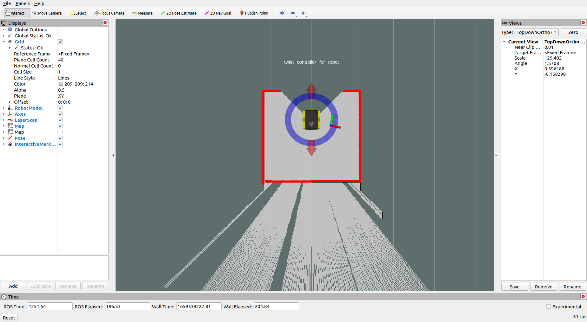

# robot-multi-floor-navigation
This repository is for Jackal UGV elevator navigation. Demo can be found [here](https://github.com/arwinder-jaspal/robot-multi-floor-navigation/blob/main/README.md#demo)

## Goal 
In this simultion, we will be using the [Clearpath Jackal](https://clearpathrobotics.com/jackal-small-unmanned-ground-vehicle/) tranverse between 2 floors (floor 0 and floor 1) using an elevator. Few barrier were placed in the world for the UGV to navigate. The simulation world can be found [here](https://bitbucket.org/swaroophs/jackal_elevator/src/master/). 

<p align = "center"></p>
<p align = "center">
Fig.1 - Simulated Environment 
</p>

## Scenario Simulated
1. Navigate from point 1:`(4.0, -5.0, 0.5)` to point 2:`(3.0,-0.5,0.5)`
2. Enter the lift at level 0 (point 2:`(3.0,-0.5,0.5)` to point 3:`(0.0,-0.5,0.5)`)
3. Send the lift from level 0 to level 1 
4. Exit lift at level 1 to point 4:`(3.0,-0.5,3.2)`
5. Switch Map to level 1 and localize robot
6. Navigate from point 5:`(3.0,-0.5,3.2)` to point 6:`(4.0,5.0,3.2`

## Installation
### Dependencies Installation
For ROS Melodic: 
```
$ sudo apt-get install ros-melodic-jackal-*
```
For ROS Noetic: 
```
$ sudo apt-get install ros-noetic-jackal-*
```
### ROS Workspace Setup (Neotic)
***Change the ROS distro to Melodic if needed. The steps are the same***
1. Create a ROS Workspace (for example `catkin_ws`)
```
$ source /opt/ros/noetic/setup.bash 
$ mkdir -p ~/catkin_ws/src
$ cd ~/catkin_ws/
$ catkin_make$ sou

$ cd ~/catkin_ws/src
$ git clone git@github.com:arwinder-jaspal/robot-multi-floor-navigation.git
```

3. Clone Additional Reposity 
```
$ cd ~/catkin_ws/src
$ git clone git@github.com:jackal/jackal_simulator.git
$ git clone git@github.com:jackal/jackal_desktop.git
$ git clone git clone https://<username>@bitbucket.org/swaroophs/jackal_elevator.git
```

4. Build the Workspace
```
$ cd ~/catkin_ws
$ catkin_make
```

## Mapping 
For Mapping, we will use the `gmapping` package from ROS.
1.  To launch the package:
```
$ source ~/catkin_ws/devel/setup,bash
$ roslaunch multi_floor_nav mapping.launch
```
This will launch RViz and Gazebo for mapping. 

To begin mapping, use the `Interaction Marker` on RViz

<p align = "center">
Fig.1 - Rviz For Mapping With Interactive Marker
</p>

2.  Once, map is generated, on a new terminal run the `map_saver` node from `map_server` package to write the map to file.
```
$ source ~/catkin_ws/devel/setup.bash
$ rosrun map_server map_saver -f <map_filename>.yaml
```
This will save 2 files (1 .pgm file and 1 .yaml) to the current directory

This will by default generate the map for floor 0. To map for floor 1, edit the `z_pos` param in the mapping launch file and repeat steps 1 and 2.
```
$ cd ~/catkin_ws/src/robot-multi-floor-navigation/multi_floor_nav/launch
$ nano mapping.launch
```
***The map files are already generated for this repo***

## Navigation

1.  To run the simulation 2 terminals is needed
-   1 terminal to launch the nodes 
-   1 terminal to start the simulation 

2.  Build the workspace
```
$ cd ~/catkin_ws
$ catkin_make
```
3. Source both the terminal
```
source ~/catkin_ws/devel/setup.bash
```
4. Launch the navigation nodes on the first terminal
```
$ roslaunch multi_floor_nav nav.launch
```
This will launch the few nodes:
- gazebo: for visualization
- map_server: 2 map server will be launch(one for each map file) to load laser maps
- amcl: for robot localization 
- move_base: for planning 
- rviz: for visualization 
- change_map_node: for handle map switching operations
- multi_floor_nav_node: node with a state machine to handle map switching, sending of move_base goals and odom goals, and controlling the elevator

5.  On the second terminal, we will send the signal to start the state machine on multi_floor_nav_node. To do so, run the following command **ONCE**:
```
$ rostopic pub /start std_msgs/Empty "{}"
```
This will start the state machine on `multi_floor_nav_node`. 
The purpose for this topic is to allow enough time on slower machines to load visualization tools such as Gazebo.

## Demo 
https://github.com/user-attachments/assets/d79f4a2a-3cd6-49e2-abfe-5730887da829

